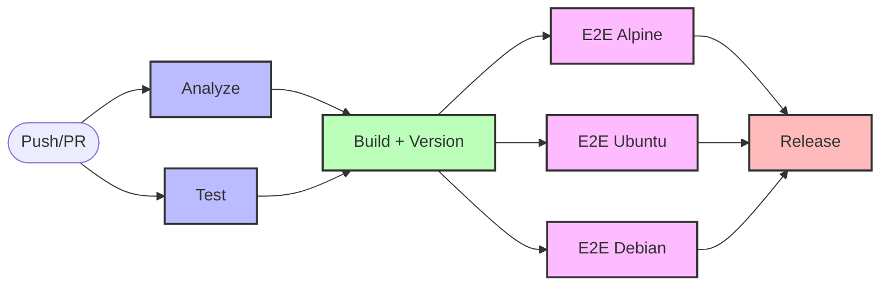

# CI/CD Workflow Structure

## Workflow Execution Flow

## Jobs Description

### 1. **Analyze** & **Test** (in parallel ~1m)

- **Analyze**: Code quality checks with golangci-lint
- **Test**: Unit tests with Bazel

### 2. **Build** (1m)

- Determines version number
- Waits for both Analyze and Test to succeed
- Builds Linux binary for E2E tests
- Creates artifact for E2E tests

### 3. **E2E** (in parallel ~1m30s)

- Tests on Alpine (OpenRC)
- Tests on Ubuntu (systemd)
- Tests on Debian (sysvinit)

### 4. **Release** (only on main)

- Creates multi-platform binaries
- Creates GitHub release

## Total Time

- **PR**: ~2-3 minutes (Analyze/Test → Build → E2E)
- **Main**: +2 minutes for Release

## Optimizations

- ✅ Parallel execution of Analyze and Test
- ✅ Parallel execution of E2E tests
- ✅ Single binary build reused for all E2E tests
- ✅ Cached dependencies with Bazel
- ✅ Matrix strategy for E2E tests
